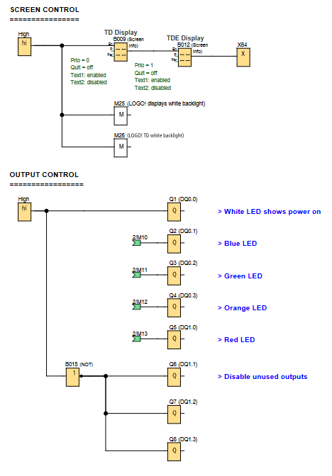
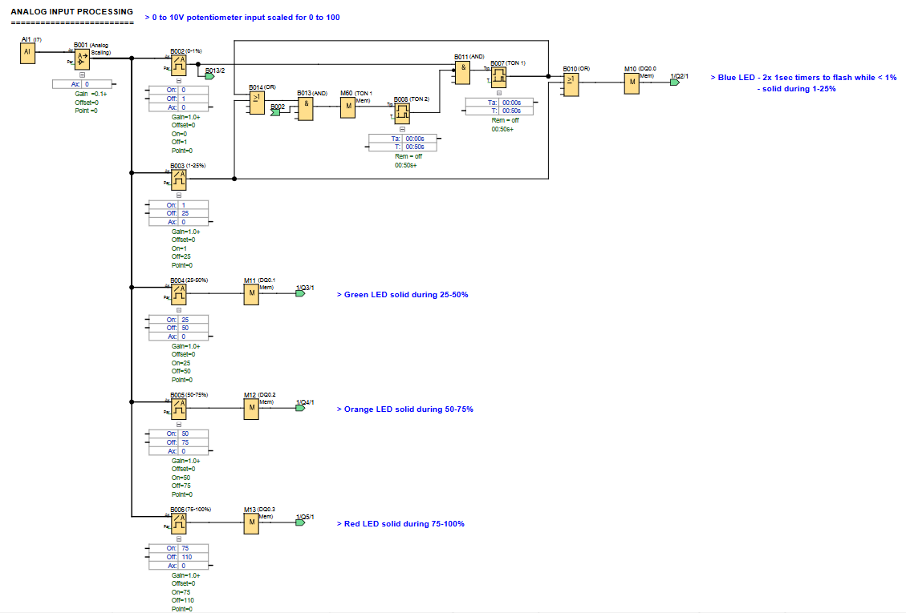

# LOGO! PLC Project: Analog LED Control

**Control Digital outputs via an Analog input**

## 🖥️ LOGO!Soft FBD Programs

### Screen & Output Control

### Analog Input Processing

---

## 📌 Overview
This project demonstrates controlling the state of different coloured LEDs based on the input from a **0-10V analog potentiometer** using LOGO!Soft. The core logic is split into two sections: **Analog Input Processing** and **Output Control**. The analog input from the potentiometer is scaled and then used to trigger different outputs at various voltage ranges.

Useful for:
- Creating a visual feedback system where LED colours change based on a continuous analog input.
- Basic PLC control system for pumps, fans, mixers, tower-lights, etc.

---

## 🧩 Required Blocks & Roles

| Block Type                    | Symbol ID                  | Purpose                                                |
|-------------------------------|----------------------------|--------------------------------------------------------|
| **Analog Inputs**             | `I7/AI1`                   | Potentiometer input (0-10V).                           |
| **Analog Scaling**            | `B001`                     | Scales 0-10 to 0-100.                                  |
| **Analog Threshold Triggers** | `B002/B003/B004/B005/B006` | Trigger on at certain values (e.g: 25, 50, 75, etc).   |
| **Timer ON Delays**           | `B007/B008`                | Used to create a flashing effect for the blue LED.     |
| **OR Gates**                  | `B010/B014`                | Combines two inputs to activate a single output.       |
| **AND Gates**                 | `B011/B013`                | Requires both inputs to be true to activate an output. |
| **Output Coils**              | `Q1/Q2/Q3/Q4/Q5`           | Physical outputs.                                      |

---

## ⚙️ How the Timers work

Two **ON-DELAY Timers** (`B007` and `B008`) are used to create a flashing effect for the blue LED when the scaled analog input value is **less than 1%**. When the scaled value is between 1% and 25%, the blue LED is solid.

### **B007 (TON1)**
- This timer is activated by the AND gate `B011`, with the analog threshold trigger `B002` (0-1%) when the scaled input is between 0 and 1, and with an inverted active TON2 signal.
- The timer has an on-delay of **0.5sec**. It will output a signal after its input has been on for this duration.
- Its output is connected to the OR gate `B010`, which feeds into output `Q2`.

### **B008 (TON2)**
- This timer is activated by 2 gates.
  - The OR gate `B014`, with either a signal from `TON1` OR a signal from the analog threshold trigger `B003` (1-25%) when the scaled input is between 1 and 25.
  - The AND gate `B013`, with a signal from OR gate `B014` AND with the analog threshold trigger `B002` (0-1%) when the scaled input is between 0 and 1.
  - A memory flag `M60` is required to connect AND gate `B013` to TON2's trigger.
- It has an on-delay of **0.5sec**.
- The output of this timer is connected to an inverted **AND gate** (`B011`) input, which then controls the output for the blue LED (`Q2`).

*Key Insight: The combination of these two 0.50s ON-DELAY timers creates a blinking effect with a 50% duty cycle, ensuring the blue LED flashes as long as the scaled analog input remains below 1% by resetting each others triggers.*

