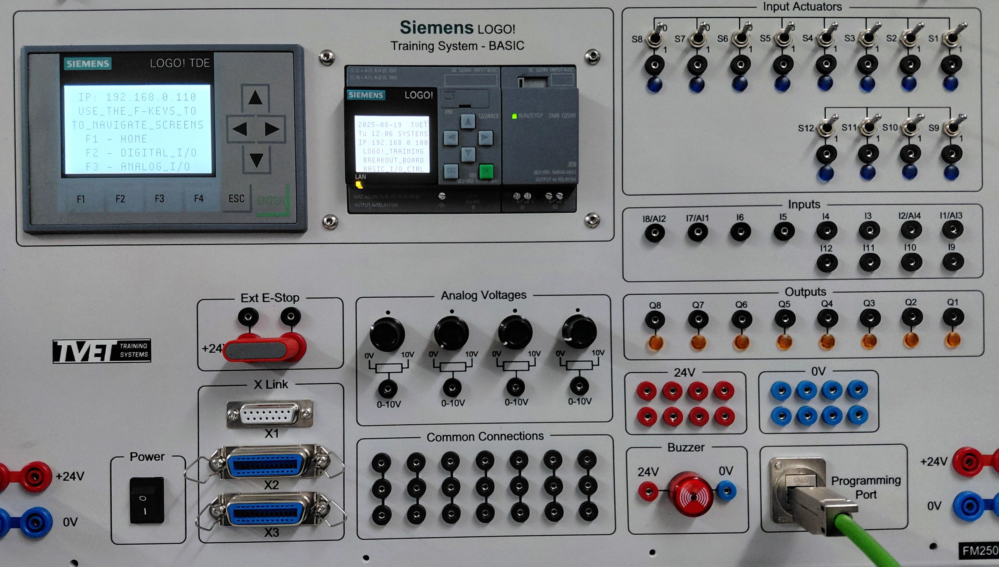

# LOGO! PLC Project: Basic I/O Control

**Testing the functionality of the TVET Training Systems LOGO! Breakout-Board inputs & outputs**

### Breakout-Board

---

## 📌 Overview

This project is designed to be used to test the various Digital & Anaglog Inputs as well as Digital Outputs of the TVET Systems LOGO! Breakout-Board. It is out-of-scope for students but this project needs to be understood by the lecturer to make sure the board is functioning properly.

This project can also serve as a template that can be modified for other projects.

### **Mode Selection**
The TDE Display F-Keys are used to select 'testing modes'.
- F1 → Home Screen
- F2 → Digital I/O Screen
    - C-Key Right → Next
    - C-Key Left  → Back
    - While in the Digital I/O testing mode, the outputs cannot be affected by the Analog inputs.
- F3 → Analog I/O Screen
    - While in the Analog I/O testing mode, the outputs cannot be affected by the Digital inputs.

*Note: for the C-keys to be used as PB inputs, the ESC key **MUST** be pressed **WHILE** pressing a C-key.*

---

## 🔌 Connection Guide

### **Built-In Digital I/O**
IN1 → OUT1
IN2 → OUT2
IN3 → OUT3
IN4 → OUT4
IN5 → NC (Up/Down counter only)
IN6 → NC (Up/Down counter only)
IN7 → NC (Up/Down counter only)
IN8 → NC (Up/Down counter only)

### **Expantion-Card Digital I/O**
IN9  → OUT5
IN10 → OUT6
IN11 → OUT7
IN12 → OUT8

### **Analog I/O**
AI1(IN7) → OUT1
AI2(IN8) → OUT2
AI3(IN1) → OUT3
AI4(IN2) → OUT4