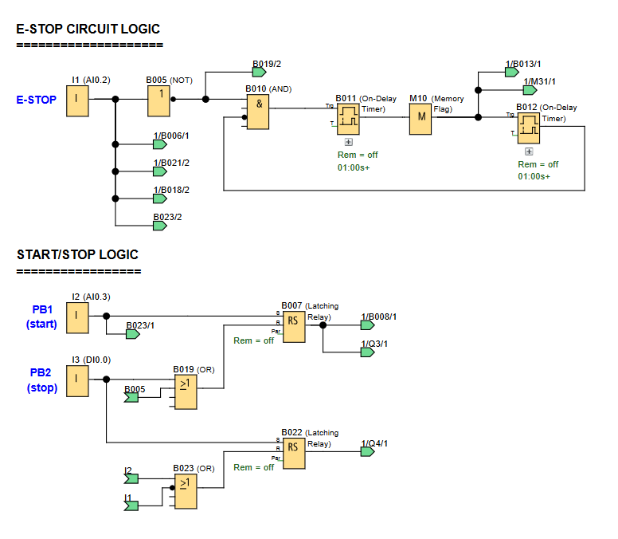

# LOGO! PLC Project: E-Stop Circuit

**Control System Status via E-Stop and Push Buttons**

## 🖥️ LOGO!Soft FBD Programs

### Screen & Output Control

### System Control Logic

---

## 📌 Overview

This project demonstrates an **E-Stop circuit** that interrupts the system when triggered. The E-Stop is physically wired to cut power to the LOGO!'s outputs, so all LEDs turn off. The TDE Display provides user notification by flashing red and white with status text. The E-Stop also resets the system to its initial startup state. The system status is shown using different colored LEDs.

Useful for:
- Demonstrating a safety circuit that physically interrupts power to outputs.
- Learning how to use a latching relay and message texts for user feedback.
- Creating a system with distinct "Ready," "Start," and "Stop" states indicated by LEDs.

---

## 🧩 Required Blocks & Roles

| Block Type           | Symbol ID             | Purpose                                                                   |
|----------------------|-----------------------|---------------------------------------------------------------------------|
| **Digital Inputs**   | `I1/I2/I3`            | Momentary pushbutton inputs (NO contacts)                                 |
| **Latching Relays**  | `B007/B014/B015/B022` | Used to maintain states (e.g., System Ready, System Running) until reset. |
| **Up/Down Counters** | `B009/B016/B020`      | Used to display system states on the TD Display.                          |
| **Message Texts**    | `B001/B002/B003/B017` | Display system information on the LOGO! and TDE displays.                 |
| **OR Gates**         | `B019/B021/B023`      | Combines inputs to activate a single output.                              |
| **NOR Gate**         | `B013`                | Combines inputs to invertly activate a single output.                     |
| **AND Gates**        | `B006/B010/B018`      | Requires multiple inputs to be true to activate an output.                |
| **NOT Gates**        | `B004/B005/B008`      | Inverts the logical state of an input.                                    |
| **Output Coils**     | `Q1/Q2/Q3/Q4`         | Physical outputs.                                                         |

---

## ⚙️ E-Stop & Start/Stop Logic

The E-Stop functionality is a critical safety feature that takes precedence over all other operations.

### **E-Stop Circuit Logic**
- The E-Stop button is wired to Input `I1` as a **Normally Closed (N/C)** contact. This means the circuit is always complete unless the E-Stop is pressed.
- When the E-Stop is active (pressed), it sends a signal to NOT gate `B005` which inverts the E-Stop signal. This in turn activates a flashing sequence to change the TDE Displays colour every second, while the system state is reset by resetting latching relays `B007` and `B022`.
- Due to the physical wiring, when the E-Stop is triggered, power to the outputs is cut, turning off all LEDs, with the E-Stop logic resetting the system to it's startup state.

### **Start/Stop Logic**
- The Start/Stop logic uses **Latching Relays** (`B007` and `B022`) to control the system states.
- Pressing **Push-Button1 `I2` (Start)** sets the `B007` latching relay, which activates the `System Running` state (Green LED) as well as resetting `B022` latching relay.
- Pressing **Push-Button2 `I3` (Stop)** sets the `B022` latching relay, which activates the `System Stopped` state (Orange LED) as well as resetting `B007` latching relay.
- On system startup, or after an E-Stop reset event, the Blue LED indicates that the system state is ready.

*Key Insight: The E-Stop's physical wiring to cut power to the outputs is the primary safety mechanism, while the PLC's internal logic and message displays provide visual notification and a software-based system reset upon a hardware-level interruption.*