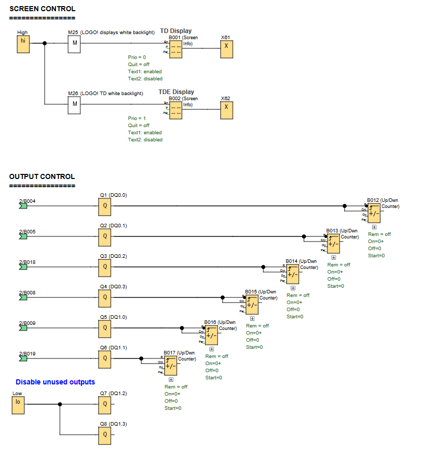
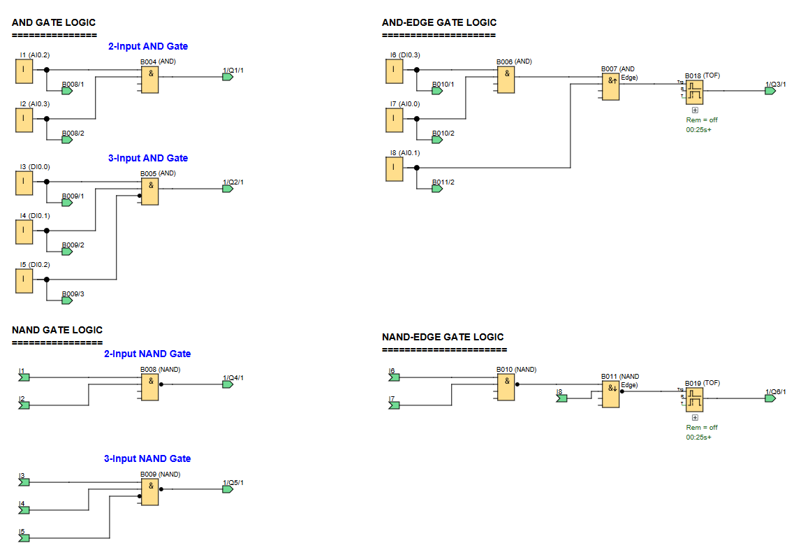

# LOGO! PLC Project: AND Gate Logic Demonstration

**Demonstration various AND gate configurations available on a LOGO! PLC**

## 🖥️ LOGO!Soft FBD Programs

### Screen & Output Control

### Gate Configurations

---

## 📌 Overview

This project demonstrates the implementation and behavior of different AND gate configurations in LOGO! PLC, including:
- Standard 2-input AND gates
- 3-input AND gates with an inverted input
- AND-Edge gates
- NAND & NAND-Edge gate variants

---

## 🧩 Required Blocks & Roles

| Block Type           | Symbol ID                       | Purpose                                             |
|----------------------|---------------------------------|-----------------------------------------------------|
| **Digital Inputs**   | `I1/I2/I3/I4/I5/I6/I7/I8`       | Switch inputs for gate testing                      |
| **AND Gates**        | `B004/B005/B006/B007`           | Various AND gate implementations                    |
| **NAND Gates**       | `B008/B009/B010/B011`           | NAND gate implementations including edge-triggered. |
| **Up/Down Counters** | `B012/B013/B014/B015/B016/B017` | Output behavior visualization.                      |
| **Timer OFF Delays** | `B018/B019`                     | Timing functions (25s delay)                        |
| **Output Coils**     | `Q1/Q2/Q3/Q4/Q5/Q6/Q7/Q8`       | Physical outputs connected to display counters.     |

---

## ⚙️ How the Logic Gates Work

The project demonstrates core AND gate principles through physical switches and visual counters:

### **Basic AND Gates:**
- 2-input AND `B004`: Requires both I1 and I2 to be HIGH for Q1 activation
- 3-input AND `B005`: Requires I3, I4, I5 (with inverted input for `I5`) for Q2 activation

### **AND-Edge Gate:**
- Combines edge detection with AND logic `B007`
- Requires specific transition patterns on `I6`, `I7` with `I8`for `Q3` activation

### **NAND Variants:**
- Standard 2-input NAND `B008`: Inverted output of basic AND
- 3-input NAND `B009`: Demonstrates De Morgan's theorem application
- NAND-Edge `B011`: Combines edge detection with NAND logic

*Key Insight: NAND variants behave opposite to thier AND counterparts.*

Notes:
- The up/down counters `B012-B017` attached to each output provide visual feedback of the output behavious.
- The TOF timers `B018/B019` are used to hold the output pulses of the AND-Edge & NAND-Edge blocks for 25ms, otherwise the pulses may not be observable.

---

## 🧠 Explaining De Morgan's Theorem

1. **What it does**: It's like a "math rule" for flipping AND/OR gates when you invert them.
2. **Two main rules**:
   - **Rule 1**: `NOT (A AND B)` = `(NOT A) OR (NOT B)`
     *(Flipping an AND gate turns it into an OR gate with inverted inputs)*
   - **Rule 2**: `NOT (A OR B)` = `(NOT A) AND (NOT B)`
     *(Flipping an OR gate turns it into an AND gate with inverted inputs)*

### **How it Applies to `B009` (3-input NAND)**
- A **NAND gate** is just an **AND gate + NOT gate**
- Using De Morgan's Rule 1:
  - Original: `NOT (I3 AND I4 AND I5)`
  - Becomes: `(NOT I3) OR (NOT I4) OR (NOT I5)`
- **What you see in the project**:
  - One input (e.g., `I5`) is *physically inverted* (like a NOT gate).
  - This matches De Morgan's rule—turning the AND into an OR-like behavior when inverted.

### **Key Takeaway**
De Morgan's theorem helps simplify complex logic by flipping gates "inside out." In `B009`, the inverted input makes the NAND gate behave like an OR gate with some inverted inputs — just as the theorem predicts.

*(No need to memorize the math—just remember: "Flip the gate, flip the inputs!")*

---

## 📊 Truth Tables for AND Gate Configurations

*open the LOGO! project, copy these into a text editor & complete the truth tables*

### **2-Input AND Gate (B004 → Q1)**
| I1 | I2 | Q1 |
|----|----|----|
| 0  | 0  |    |
| 0  | 1  |    |
| 1  | 0  |    |
| 1  | 1  |    |

*Control Bit: _____*

### **3-Input AND Gate (B005 → Q2)**
| I3 | I4 | I5 | Q2 |
|----|----|----|----|
| 0  | 0  | 0  |    |
| 0  | 0  | 1  |    |
| 0  | 1  | 0  |    |
| 0  | 1  | 1  |    |
| 1  | 0  | 0  |    |
| 1  | 0  | 1  |    |
| 1  | 1  | 0  |    |
| 1  | 1  | 1  |    |

*Control Bit: _____*

### **AND-Edge Gate (B007 → Q3)**
| I6 (Edge) | I7 | I8 | Q3 |
|-----------|----|----|----|
| ↑         | 0  | 0  |    |
| ↑         | 0  | 1  |    |
| ↑         | 1  | 0  |    |
| ↑         | 1  | 1  |    |
| ↓         | 0  | 0  |    |
| ↓         | 0  | 1  |    |
| ↓         | 1  | 0  |    |
| ↓         | 1  | 1  |    |

*Control Bit: _____*

### **2-Input NAND Gate (B008 → Q4)**
| I1 | I2 | Q4 |
|----|----|----|
| 0  | 0  |    |
| 0  | 1  |    |
| 1  | 0  |    |
| 1  | 1  |    |

*Control Bit: _____*

### **3-Input NAND Gate (B009 → Q5)**
| I3 | I4 | I5 | Q5 |
|----|----|----|----|
| 0  | 0  | 0  |    |
| 0  | 0  | 1  |    |
| 0  | 1  | 0  |    |
| 0  | 1  | 1  |    |
| 1  | 0  | 0  |    |
| 1  | 0  | 1  |    |
| 1  | 1  | 0  |    |
| 1  | 1  | 1  |    |

*Control Bit: _____*

### **NAND-Edge Gate (B011 → Q6)**
| I6 (Edge) | I7 | I8 | Q6 |
|-----------|----|----|----|
| ↑         | 0  | 0  |    |
| ↑         | 0  | 1  |    |
| ↑         | 1  | 0  |    |
| ↑         | 1  | 1  |    |
| ↓         | 0  | 0  |    |
| ↓         | 0  | 1  |    |
| ↓         | 1  | 0  |    |
| ↓         | 1  | 1  |    |

*Control Bit: _____*

