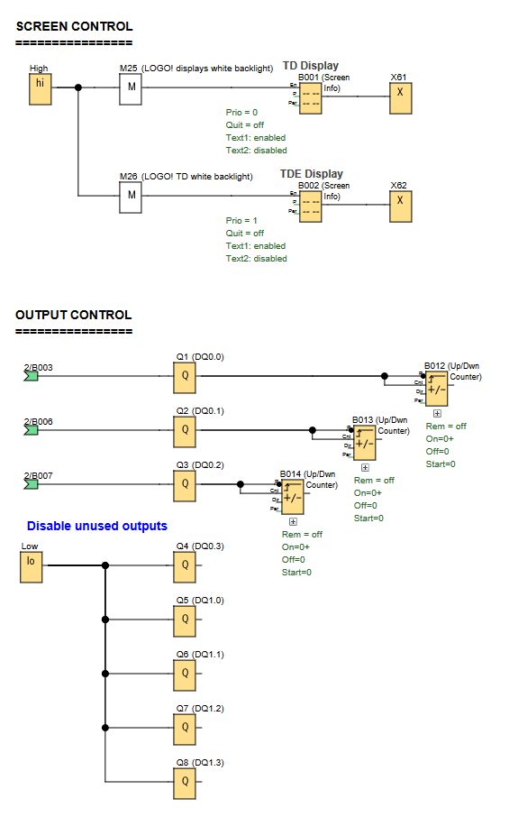
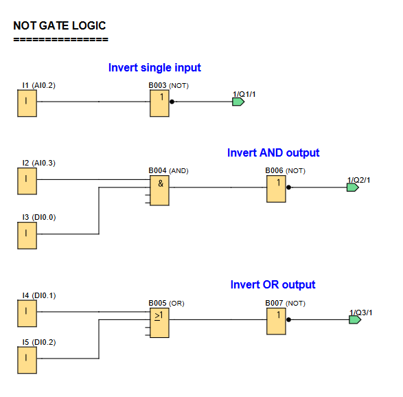

# LOGO! PLC Project: NOT Gate Logic Demonstration

**Demonstration of various NOT gate configurations available on a LOGO! PLC**

## 🖥️ LOGO!Soft FBD Programs

### Screen & Output Control

### Gate Configurations

---

## 📌 Overview

This project demonstrates the implementation and behavior of NOT gate configurations in LOGO! PLC, including:
- Basic NOT gate inversion
- NOT gate combined with AND gates
- NOT gate combined with OR gates
- Practical applications using up/down counters for output visualization

---

## 🧩 Required Blocks & Roles

| Block Type           | Symbol ID   | Purpose                                             |
|----------------------|-------------|-----------------------------------------------------|
| **Digital Inputs**   | `I1-I5`     | Switch inputs for gate testing.                     |
| **NOT Gates**        | `B003-B005` | Basic inversion and combined logic implementations. |
| **AND Gate**         | `B006`      | AND logic with NOT gate combination.                |
| **OR Gate**          | `B007`      | OR logic with NOT gate combination.                 |
| **Up/Down Counters** | `B012-B014` | Output behavior visualization.                      |
| **Output Coils**     | `Q1-Q3`     | Physical outputs connected to display counters.     |

---

## ⚙️ How the Logic Gates Work

The project demonstrates core NOT gate principles through physical switches and visual counters:

### **Basic NOT Gate:**
- Single input inversion `B003`: Output Q1 is HIGH when Input 1 (I1) is OFF

### **AND Gate with NOT Gate:**
- `B006` requires Inputs 2 AND 3 (with one input inverted) to activate Output 2

### **OR Gate with NOT Gate:**
- `B007` requires Inputs 4 OR 5 (with one input inverted) to activate Output 3

*Key Insight: NOT gates invert the input signal, creating opposite output behavior.*

Note:
- The up/down counters `B012-B014` attached to each output provide visual feedback of the output behaviors.

---

## 🧠 Logic Gate Principles

### **NOT Gate Fundamentals**
1. **Basic Function**: Inverts the input signal (1 becomes 0, 0 becomes 1)
2. **Symbol**: Often represented as a triangle with a circle at the output
3. **Truth Table**:
   | Input | Output |
   |-------|--------|
   |   0   |    1   |
   |   1   |    0   |

### **Combining NOT with Other Gates**
- **With AND Gate**: Creates NAND-like behavior
- **With OR Gate**: Creates NOR-like behavior
- **Practical Use**: Often used to create alternative logic paths or invert sensor signals

### **Alternative Implementations**
The project questions challenge you to find equivalent circuits without NOT gates:
- For AND+NOT: Could use NOR gate with proper input conditioning
- For OR+NOT: Could use NAND gate with proper input conditioning

---

## 💡 Key Points
1. NOT gates create logical inversion of input signals
2. Combining NOT with other gates creates new logical functions
3. The same logical outcome can often be achieved through different gate configurations

---

## 📊 Truth Tables for Gate Configurations

*open the LOGO! project, copy this document into a text editor & complete the truth tables*

### **Basic NOT Gate (B003 → Q1)**
| I1 | Q1 |
|----|----|
| 0  |    |
| 1  |    |

*Control Bit: _____*

### **AND Gate with NOT (B006 → Q2)**
| I2 | I3 | Q2 |
|----|----|----|
| 0  | 0  |    |
| 0  | 1  |    |
| 1  | 0  |    |
| 1  | 1  |    |
*Note: One input is inverted before the AND operation*

*Control Bit: _____*

### **OR Gate with NOT (B007 → Q3)**
| I4 | I5 | Q3 |
|----|----|----|
| 0  | 0  |    |
| 0  | 1  |    |
| 1  | 0  |    |
| 1  | 1  |    |
*Note: One input is inverted before the OR operation* 

*Control Bit: _____*
