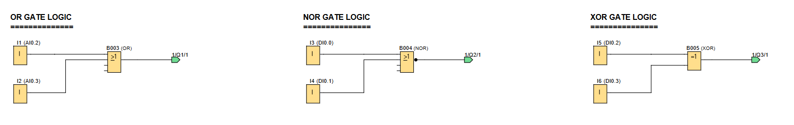

# LOGO! PLC Project: OR Gate Logic Demonstration

**Demonstration of various OR gate configurations available on a LOGO! PLC**

## 🖥️ LOGO!Soft FBD Programs

### Screen & Output Control

### Gate Configurations

---

## 📌 Overview

This project demonstrates the implementation and behavior of different OR gate configurations in LOGO! PLC, including:
- Standard 2-input OR gates
- NOR gates (OR + NOT)
- XOR gates (Exclusive OR)
- Output visualization using up/down counters

---

## 🧩 Required Blocks & Roles

| Block Type           | Symbol ID           | Purpose                                         |
|----------------------|---------------------|-------------------------------------------------|
| **Digital Inputs**   | `I1/I2/I3/I4/I5/I6` | Switch inputs for gate testing.                 |
| **OR Gate**          | `B003`              | Standard 2-input OR gate implementation.        |
| **NOR Gate**         | `B004`              | NOR gate implementation.                        |
| **XOR Gate**         | `B005`              | Exclusive OR gate implementation.               |
| **Up/Down Counters** | `B012/B013/B014`    | Output behavior visualization.                  |
| **Output Coils**     | `Q1/Q2/Q3`          | Physical outputs connected to display counters. |

---

## ⚙️ How the Logic Gates Work

The project demonstrates core OR gate principles through physical switches and visual counters:

### **Basic OR Gate:**
- 2-input OR `B003`: Requires either I1 or I2 to be HIGH for Q1 activation

### **NOR Gate:**
- 2-input NOR `B004`: Output is HIGH only when neither I3 nor I4 is HIGH

### **XOR Gate:**
- 2-input XOR `B005`: Output is HIGH when inputs I6 and I7 are different

---

## 🧠 Logic Gate Principles

1. **OR Gate**: Output is true if ANY input is true ("at least one" logic)
2. **NOR Gate**: Inverted OR gate - output is true only when ALL inputs are false
3. **XOR Gate**: Output is true when inputs DIFFER (exclusive OR)

*Key Insight: NOR is the complement of OR, while XOR adds the "exclusive" condition*

---

## 📊 Truth Tables for OR Gate Configurations

*open the LOGO! project, copy this document into a text editor & complete the truth tables*

### **OR Gate (B003 → Q1)**
| I1 | I2 | Q1 |
|----|----|----|
| 0  | 0  |    |
| 0  | 1  |    |
| 1  | 0  |    |
| 1  | 1  |    |

*Control Bit: _____*

### **NOR Gate (B004 → Q2)**
| I3 | I4 | Q2 |
|----|----|----|
| 0  | 0  |    |
| 0  | 1  |    |
| 1  | 0  |    |
| 1  | 1  |    |

*Control Bit: _____*

### **XOR Gate (B005 → Q3)**
| I6 | I7 | Q3 |
|----|----|----|
| 0  | 0  |    |
| 0  | 1  |    |
| 1  | 0  |    |
| 1  | 1  |    |

*Control Bit: _____*
