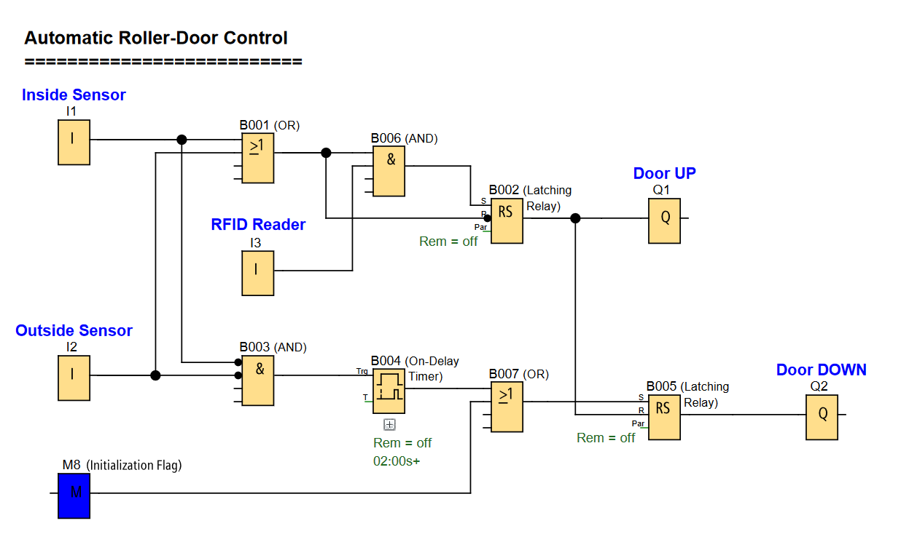

# LOGO! PLC Project: Automatic Roller Door Control System

**Automated access-controlled roller door operation with presence detection and timed closing.**

### Automatic Roller Door Control Function

---

## 📌 Overview

An automated roller door control system that opens when authorized presence is detected and closes automatically after passage is complete. Uses RFID access control and motion sensors for secure operation.

Useful for:
- **Secure Facilities:** Controlled access points with automated door operation
- **Temperature-Controlled Environments:** Minimizes door open time to maintain climate control

---

## 🧩 Required Blocks & Roles

| Block Type          | Symbol ID             | Purpose                                              |
|---------------------|-----------------------|------------------------------------------------------|
| **Digital Inputs**  | `I1/I2/I3`            | Switching inputs (NO contact)                        |
| **Logic Gates**     | `B001/B003/B006/B007` | Condition checking for enable outputs.               |
| **Latching Relays** | `B002/B005`           | Maintains door open/close states.                    |
| **On-Delay Timer**  | `B004`                | 2-second delay before closing.                       |
| **Memory Flag**     | `M8`                  | Initialization Flag (ensures door closed on startup) |
| **Outputs**         | `Q1/Q2`               | Physical outputs.                                    |

---

## 🚪 Door Operation Logic

### Opening Sequence:
- **Detection:** Motion detected at either inside (I1) or outside (I2) sensor
- **Authorization:** RFID Reader (I3) sends Read-OK signal
- **Action:** Door rolls up (Q1 activated) when both presence AND authorization are confirmed

### Closing Sequence:
- **Condition:** Both motion sensors (I1 and I2) are OFF (no presence detected)
- **Delay:** 2-second timer (B004) activates after sensors go OFF
- **Action:** Door rolls down (Q2 activated) after delay period

---

## ✔️ Advantages

- **Access Control:** Door only opens for authorized personnel with valid RFID tags
- **Energy Efficient:** Door remains open only when needed, minimizing temperature loss/gain
- **Reliable Operation:** Latching relays maintain state during operation
- **Easy Modification:** Project logic can be easily adapted to other door systems
- **Simple Installation:** Existing installations can be easily modified or upgraded
- **Startup Safety:** Initialization flag ensures door is closed on system startup

---

## 🛠️ Notes

- Circuit is designed using **Siemens LOGO! Soft Comfort** software
- Motion sensors detect presence momentarily as objects pass through
- RFID reader has wide detection radius from both sides of the door
- The system uses latching relays to maintain the door open state until closing conditions are met