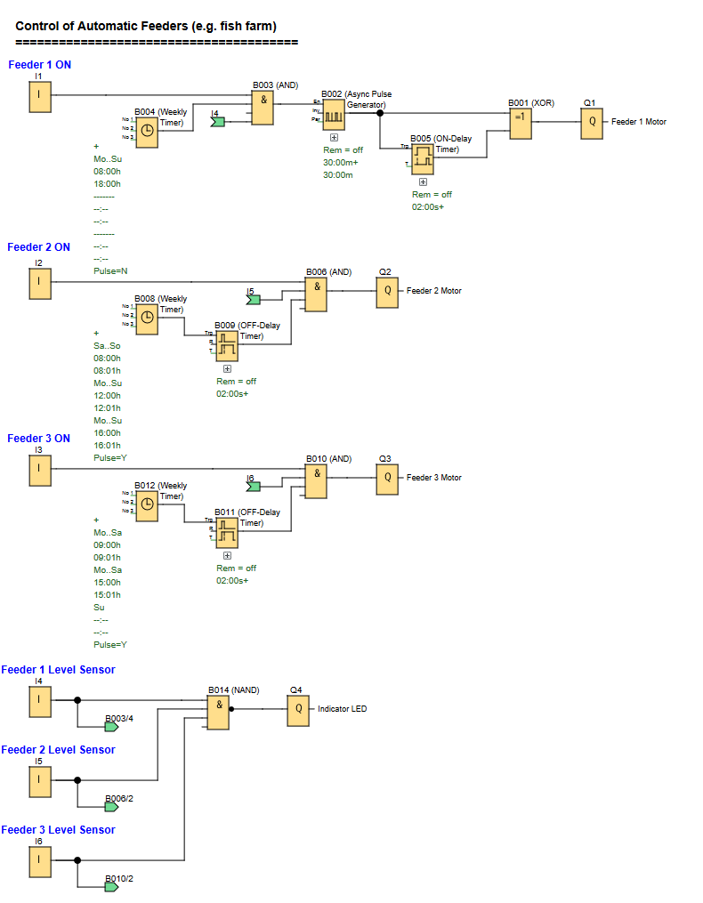

# LOGO! PLC Project: Automatic Fish Feeders Control System

**Automated scheduled feeding for multiple fish types with feed-level detection.**

### Automatic Fish Feeder Control Function

---

## 📌 Overview

An automated feeding system that controls three separate fish feeders with different schedules based on fish type (Brood, Young, and Adult fish). Includes empty container detection to prevent battery drain and signal when refilling of feed is needed.

Useful for:
- **Aquaculture Operations:** Automated feeding for fish farms using solar & battery power

---

## 🧩 Required Blocks & Roles

| Block Type          | Symbol ID                  | Purpose                                                   |
|---------------------|----------------------------|-----------------------------------------------------------|
| **Digital Inputs**  | `I1/I2/I3/I4/I5/I6`        | Switching inputs (NO contact)                             |
| **Weekly Timers**   | `B004/B008/B012`           | Schedule control for each feeder type.                    |
| **Pulse Generator** | `B002`                     | Generate feeding pulse every hour.                        |
| **Timers**          | `B005/B009/B011`           | Control feeding duration (2 seconds)                      |
| **Logic Gates**     | `B001/B002/B006/B010/B014` | Condition checking for enable switches and level sensors. |
| **Outputs**         | `Q1/Q2/Q3/Q4`              | Physical outputs.                                         |

---

## 📊 Feeding Schedule

### Feeder 1 (Q1) - Brood Fish
- **Schedule:** Every hour from 8:00 AM to 6:00 PM, daily
- **Duration:** 2 seconds per feeding
- **Conditions:** I1 ON AND I4 (Level Sensor) NOT Empty (ON)

### Feeder 2 (Q2) - Young Fish
- **Schedule:** 
  - Weekdays: 12:00 PM and 4:00 PM
  - Weekends: Additional feeding at 8:00 AM
- **Duration:** 2 seconds per feeding
- **Conditions:** I2 ON AND I5 (Level Sensor) NOT Empty (ON)

### Feeder 3 (Q3) - Adult Fish
- **Schedule:** Monday-Saturday at 9:00 AM and 3:00 PM (No Sunday feeding)
- **Duration:** 2 seconds per feeding
- **Conditions:** I3 ON AND I6 (Level Sensor) NOT Empty (ON)

---

## ✔️ Advantages

- **Battery Conservation:** Automatically disables empty feeders to prevent unnecessary battery drain
- **Flexible Scheduling:** Easy modification of feeding times through timer blocks
- **Visual Alert System:** Single LED indicates when any feeder needs refilling
- **Standalone Operation:** Can operate on LOGO! 12RC without AC power (battery-powered)
- **Scalable Design:** Control program can be reused for multiple tanks in large fish farms
- **Fail-Safe Operation:** Requires both manual enable AND available food to operate

---

## 🛠️ Notes

- Circuit is designed using **Siemens LOGO! Soft Comfort** software.
- Level sensors are normally open (NO) and turn OFF when container is empty.
- All feeders use 12V motors, that when active, vibrates the container which ensures consistent food dispensing.
- The system uses internal pulse generators for reliable timing control.
