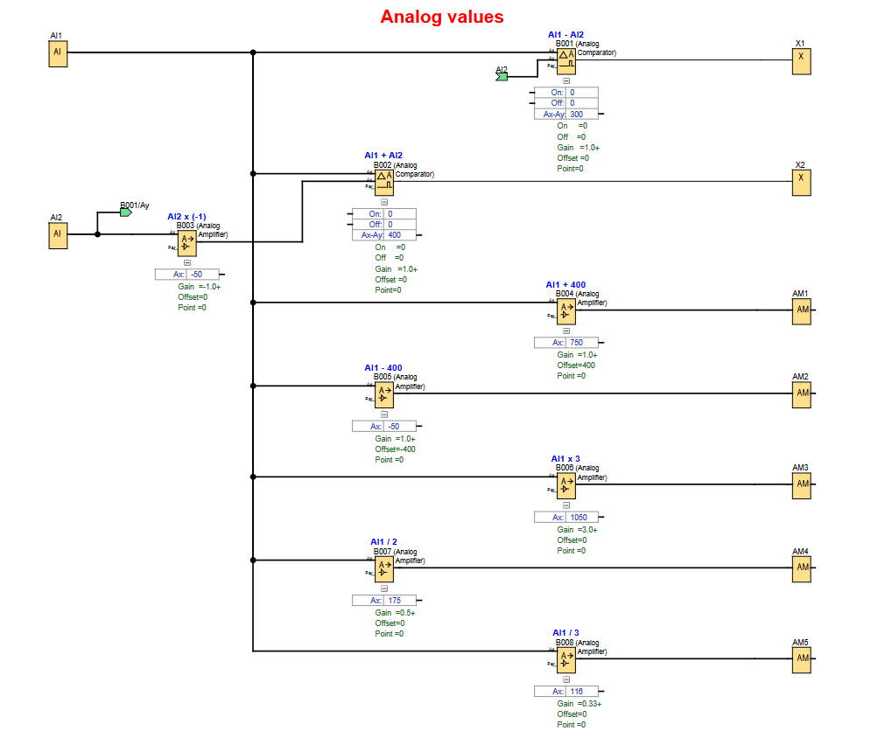
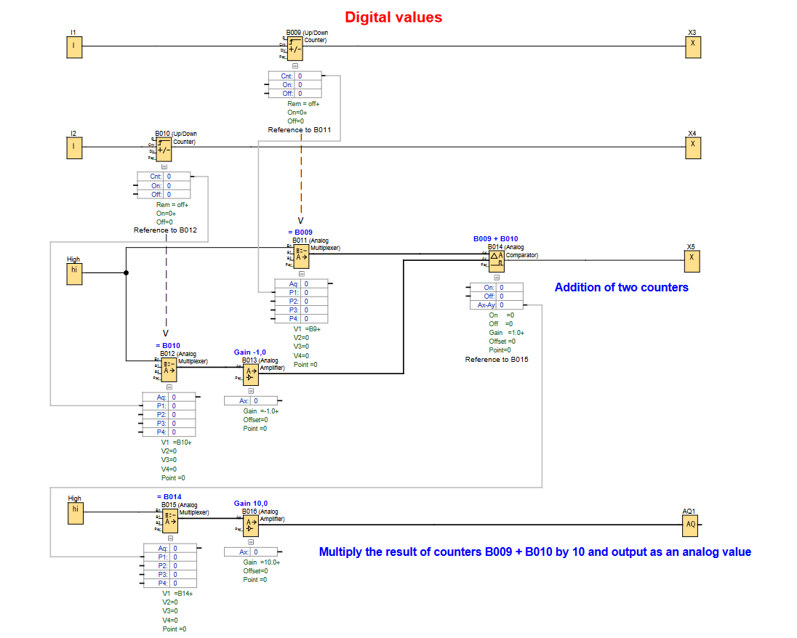

# LOGO! PLC Project: Basic Arithmetic Operations

**Demonstrates how simple calculations ( + , - , x , / ) are possible with LOGO! .**

## 🖥️ LOGO!Soft FBD Programs

### Analog values

### Digital values

---

## 📌 Overview
The calculation examples can be adapted to fit requirements for other projects where values need to me manipluated for use in other parts of the application or displayed on a screen.

Analog values:
- **B001** subtracts the value of AI2 from AI1 `[AI1 - AI2]`
- **B002** sums the values of AI1 & AI2 `[AI1 + AI2]`
- **B003** multiplies AI2 value by -1 (makes value negative) `[AI2 x (-1)]`
- **B004** adds 400 to AI1 value `[AI1 + 400]`
- **B005** subtracts 400 from AI1 value `[AI1 - 400]`
- **B006** multiplies AI1 by 3 `[AI1 x 3]`
- **B007** divides AI1 by 2 `[AI1 / 2]`
- **B008** divides AI1 by 3 `[AI1 / 3]`

Digital values:
- **B009** counts UP with trigger from input 1 `[references to B011]`
- **B010** counts UP with trigger from input 2 `[references to B012]`
- **B014** adds the 2 counter values `[C1 + C2 & references to B015]`
- **B016** multiplies the added counter values by 10 `[(C1 + C2) x 10]`

---

## 🧩 Required Blocks & Roles

| Block Type              | Symbol ID                            | Purpose                                    |
|-------------------------|--------------------------------------|--------------------------------------------|
| **Analog Inputs**       | `AI1/AI2`                            | Simulation values assigned for simulation. |
| **Digital Inputs**      | `I1/I2`                              | Momentary pushbutton inputs (NO contact)   |
| **Analog Comparators**  | `B001/B002/B014`                     | Add or subtract 2 AI values.               |
| **Analog Amplifiers**   | `B004/B005/B006/B007/B008/B013/B016` | Use Gain values to perform calculations.   |
| **Analog Multiplexers** | `Q1/Q2/Q3/Q4/Q5`                     | Pass on referenced values.                 |
| **Analog Output**       | `AQ1`                                | Physical output.                           |

---
