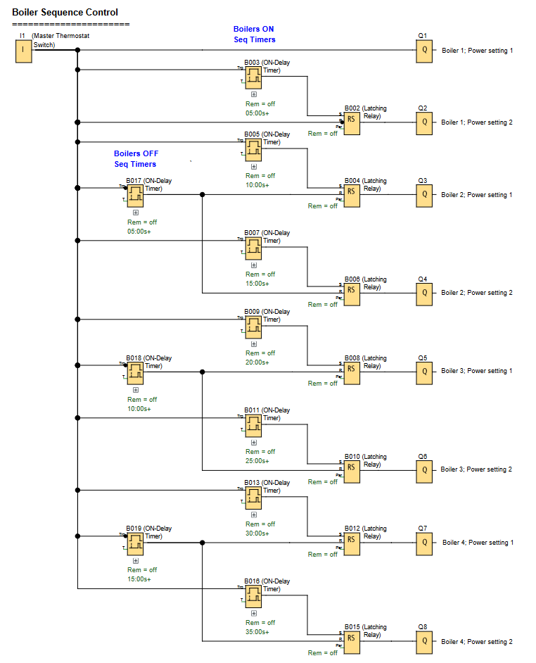

# LOGO! PLC Project: Boiler Sequence Control System

**Automated sequential startup and control for multiple boiler units with timed sequencing.**

### Boiler Sequence Control Function

---

## 📌 Overview

A sequential control system for managing multiple boiler units with timed startup sequences to prevent power surges and ensure proper system initialization. The system uses cascading timers to sequentially activate boilers with predefined delays between each unit.

Useful for:
- **Industrial Heating Systems:** Controlled startup of multiple boiler installations
- **Power Management:** Prevents simultaneous activation that could cause electrical overload
- **Process Control:** Ensures proper sequencing in industrial heating applications

---

## 🧩 Required Blocks & Roles

| Block Type             | Block ID                             | Purpose                                                 |
|------------------------|--------------------------------------|---------------------------------------------------------|
| **Digital Inputs**     | `I1`                                 | Switching input (NO contact)                            |
| **Latching Relays**    | `B002/B004/B006/B008/B010/B012/B015` | Control output states.                                  |
| **Boilers-On Timers**  | `B003/B005/B007/B009/B011/B013/B016` | Control sequential timing between boiler activations.   |
| **Boilers-Off Timers** | `B017/B018/B019`                     | Control sequential timing between boiler deactivations. |
| **Outputs**            | `Q1/Q2/Q3/Q4/Q5/Q6/Q7/Q8`            | Physical outputs.                                       |
.
---

## ⏱️ Sequence Timing

The system implements a cascading timer sequence with the following delays:

- **Boilers ON Sequence Steps:** **(Master Thermostat Switch ON)**
  - Step 1: Boiler1 power setting 1 ON
  - Step 2: 05:00 minutes (B003), Boiler1 power setting 2 ON
  - Step 3: 10:00 minutes (B005), Boiler2 power setting 1 ON
  - Step 4: 15:00 minutes (B007), Boiler2 power setting 2 ON
  - Step 5: 20:00 minutes (B009), Boiler3 power setting 1 ON
  - Step 6: 25:00 minutes (B011), Boiler3 power setting 2 ON
  - Step 7: 30:00 minutes (B013), Boiler4 power setting 1 ON
  - Step 8: 35:00 minutes (B016), Boiler4 power setting 2 ON

- **Boilers OFF Sequence Steps:** **(Master Thermostat Switch OFF)**
  - Step 1: Boiler1 power setting 1 & 2 OFF
  - Step 2: 05:00 minutes (B017), Boiler2 power setting 1 & 2 OFF
  - Step 3: 10:00 minutes (B018), Boiler3 power setting 1 & 2 OFF
  - Step 4: 15:00 minutes (B019), Boiler4 power setting 1 & 2 OFF
---

## 🔧 Operation Logic

1. **System Start:** Thermostat signal activates Boiler1 power setting 1 & the first timer (B003),
2. **Sequential Activation:** Each completed timer triggers the next boiler or power setting,
3. **Cascading Delays:** Prevents simultaneous startup with configurable delays between units,
4. **Status Maintenance:** Latching relays maintain boiler operational states,
5. **Sequential Stop:** No thermostat signal starts the deactivation sequence.

---

## ✔️ Advantages

- **Load Management:** Prevents power surges by staggering boiler startups,
- **Flexible Configuration:** Timing intervals easily adjustable through timer blocks,
- **Fail-Safe Operation:** Proper sequencing ensures safe system operation,
- **Scalable Design:** Can be expanded to control additional boiler units.

---

## 🛠️ Notes

- Circuit is designed using **Siemens LOGO! Soft Comfort** software,
- All timers are on-delay, with the Boilers OFF Sequence timers having inverted triggers,
- Timing values in the program file have been changed to seconds (from minutes) for tesing/simulation purposes.
