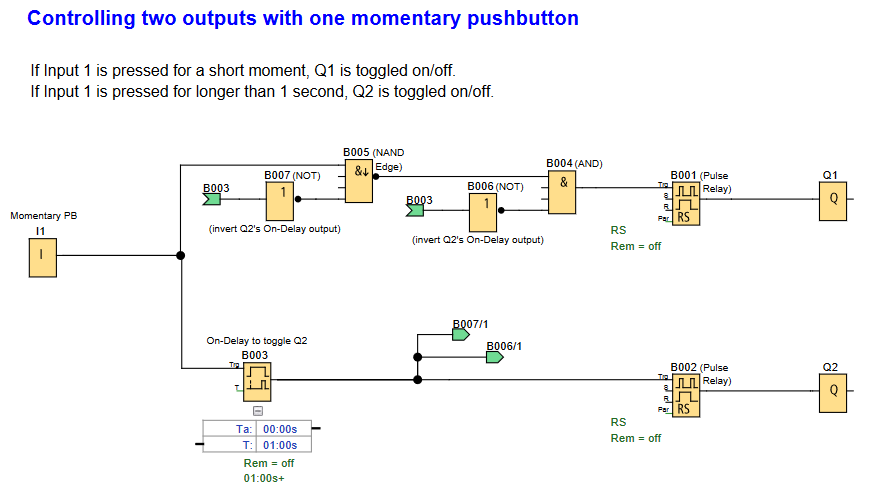

# LOGO! PLC Project: Dual-Function Pushbutton Control

**Control two outputs (Q1 & Q2) with one momentary pushbutton (I1) using press duration logic.**

## 🖥️ LOGO!Soft FBD program

---

## 📌 Overview
This project toggles **Q1** on a **short press** (<1s) and **Q2** on a **long press** (≥1s) of Input 1.

Useful for:
- Multi-mode equipment control (e.g: jog/continuous operation, auto/manual)
- Dual-function interfaces (e.g: short press for light, long press for fan)
- Space-constrained control panels
- Safety interlocks where press duration matters

---

## 🧩 Required Blocks & Roles

| Block Type          | Symbol ID   | Purpose                                             |
|---------------------|-------------|-----------------------------------------------------|
| **Digital Input**   | `I1`        | Momentary pushbutton input (NO contact)             |
| **NAND Edge**       | `B005`      | Rising edge detection with timer lockout            |
| **AND Gate**        | `B004`      | Combines edge detection + PB state + timer feedback |
| **NOT Gates**       | `B006/B007` | Isolates timer feedback paths                       |
| **Pulse Relay**     | `B001/B002` | Toggle logic with auto-reset                        |
| **On-Delay Timer**  | `B003`      | 1-second timer (Ta=01.00s)                          |
| **Output Coils**    | `Q1/Q2`     | Physical outputs                                    |

---

## 🔌 Connection Guide

### 1. **Short-Press Path (Q1 Toggle)**
<pre>
I1 → NAND Edge (B005) → AND (B004) → Pulse Relay (B001) → Q1
   ↑                  ↑
   └──B007(NOT)       └──B006(NOT)
</pre>

### 2. **Long-Press Path (Q2 Toggle)**
<pre>
I1 → On-Delay Timer (B003) → Pulse Relay (B002) → Q2
                           ↓
                           ├──B007 (NOT) → B005 (NAND Edge)
                           └──B006 (NOT) → B004 (AND)
</pre>

---

## ⚙️ Why NOT blocks?

### **B007 Path (Edge Detector Control)**
| Timer Output | B007 Output | B005 Effect               |
|--------------|-------------|---------------------------|
| Active (1)   | 0           | Disables edge detection   |
| Inactive (0) | 1           | Enables edge detection    |

### **B006 Path (AND Gate Control)**
| Timer Output | B006 Output | B004 Effect               |
|--------------|-------------|---------------------------|
| Active (1)   | 0           | Forces AND output low     |
| Inactive (0) | 1           | Allows normal AND operation |

*Key Insight: The NOT blocks create "active-low" control signals that safely isolate the timer's feedback paths. Ideally the NOT blocks can be removed & the inputs of the NAND & AND blocks inverted (by double clicking thier inputs) - but for this project, NOT blocks are used for clarity*

---
