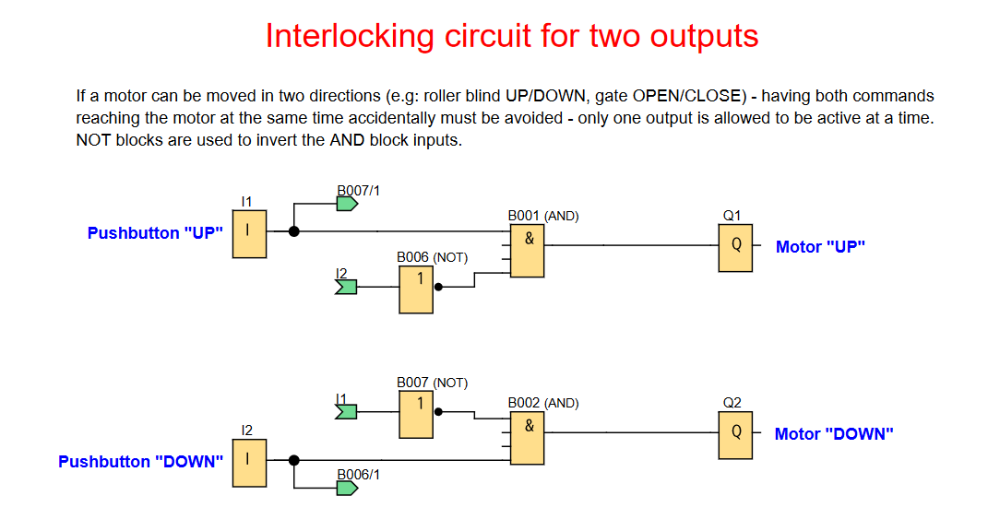
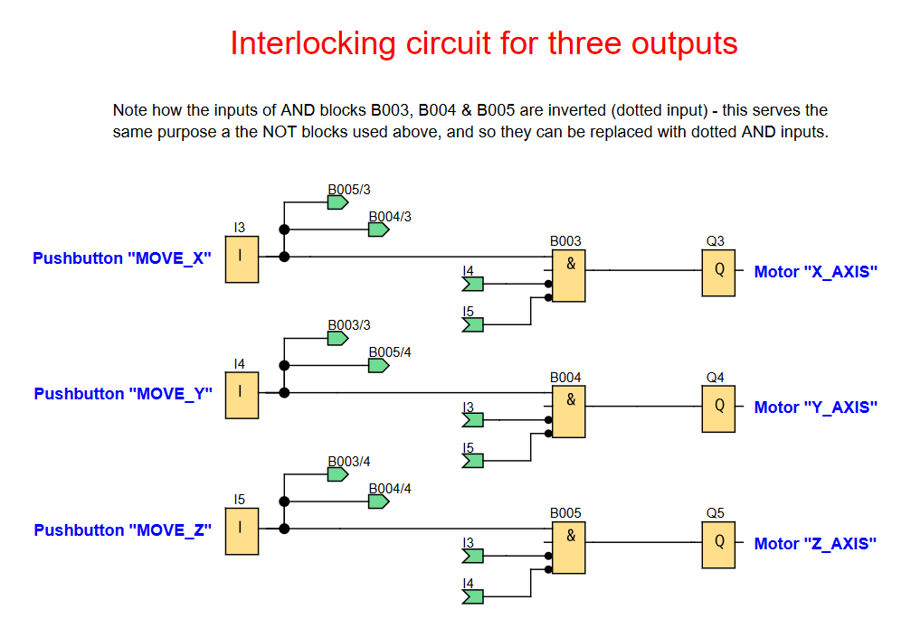

# LOGO! PLC Project: Interlocking Circuit for Multiple Outputs

**Prevent simultaneous activation of conflicting outputs (e.g., motor UP/DOWN, X/Y/Z axis movement) using interlocking logic.**

## 🖥️ LOGO!Soft FBD Programs

### Interlocking Circuit for Two Outputs

### Interlocking Circuit for Three Outputs

---

## 📌 Overview
This project demonstrates how to create interlocking circuits in LOGO!Soft to ensure that only one of a set of outputs can be active at any given time. This is crucial for applications where simultaneous activation of certain functions could lead to mechanical damage, unsafe conditions, or incorrect operation.

Useful for:
- **Motor Control:** Preventing simultaneous "UP" and "DOWN" commands for roller blinds, gates, or conveyors.
- **Axis Movement:** Ensuring only one axis (X, Y, or Z) of a machine can move at a time.
- **Safety Applications:** Implementing safety interlocks where conflicting actions must be avoided.
- **Sequential Operations:** Guiding operators through a process by only enabling the next valid step.

---

## 🧩 Required Blocks & Roles

| Block Type          | Symbol ID                  | Purpose                                                  |
|---------------------|----------------------------|----------------------------------------------------------|
| **Digital Input**   | `I1/I2/I3/I4/I5`           | Momentary pushbutton inputs (NO contact)                 |
| **AND Gate**        | `B001/B002/B003/B004/B005` | Combine the input signals with the interlocking signals. |
| **NOT Gates**       | `B006/B007`                | Invert the states of an interlocking signals.            |
| **Output Coils**    | `Q1/Q2/Q3/Q4/Q5`           | Physical outputs.                                        |

---

## 🔌 Connection Guide

### 1. **Two-Output Interlocking Example (e.g., Motor UP/DOWN)**

- **Motor "UP" (Q1) Path:**
  <pre>
  I1 → AND (B001) → Q1
     ↑
     └──B006(NOT)
          ↑
          └──I2
  </pre>

- **Motor "DOWN" (Q2) Path:**
  <pre>
  I2 → AND (B002) → Q2
     ↑
     └──B007(NOT)
          ↑
          └──I1
  </pre>
  *Note: B007/1 and B006/1 refer to the specific inputs of the NOT blocks.*

### 2. **Three-Output Interlocking Example (e.g., X/Y/Z Axis Movement)**

- **Motor "X_AXIS" (Q3) Path:**

  <pre>
  I3 → AND (B003) → Q3
     ↑
     ├── I4 (inverted input)
     ↑
     └── I5 (inverted input)
  </pre>

- **Motor "Y_AXIS" (Q4) Path:**

  <pre>
  I4 → AND (B004) → Q4
     ↑
     ├── I3 (inverted input)
     ↑
     └── I5 (inverted input)
  </pre>

- **Motor "Z_AXIS" (Q5) Path:**

  <pre>
  I5 → AND (B005) → Q5
     ↑
     ├── I3 (inverted input)
     ↑
     └── I4 (inverted input)
  </pre>

  *Note: The three-output example uses inverted inputs directly on the AND gates, eliminating the need for separate NOT blocks, which is a more compact and common practice.*

---

## ⚙️ How the Interlocking Works

The core principle of these interlocking circuits is to use the state of one output to disable the activation of other conflicting outputs.

### **Two-Output Example (using NOT blocks):**
- When `Q1` is active (ON), its signal is fed back to the `NOT` blocks (`B006`, `B007`) in the `Q2` path. These `NOT` blocks then output a `FALSE` signal, which prevents the `AND` gate (`B002`) from becoming `TRUE`, thus keeping `Q2` OFF.
- The same logic applies in reverse: when `Q2` is active, it prevents `Q1` from turning ON.

### **Three-Output Example (using inverted AND inputs):**
- Each `AND` gate (e.g., `B003` for `Q3`) has inverted inputs connected to the other outputs (`Q4`, `Q5`).
- For `Q3` to turn ON, `I3` must be pressed AND `Q4` must be OFF (inverted `Q4` is TRUE) AND `Q5` must be OFF (inverted `Q5` is TRUE).
- If any other output (e.g., `Q4`) is active, its `TRUE` signal fed to the inverted input of `B003` becomes `FALSE`, thus forcing `B003`'s output to `FALSE` and preventing `Q3` from activating.

*Key Insight: The interlocking is achieved by ensuring that the activation condition for any output includes the condition that all other conflicting outputs are currently inactive. This can be done explicitly with `NOT` blocks or more compactly by inverting the inputs of `AND` gates.*
