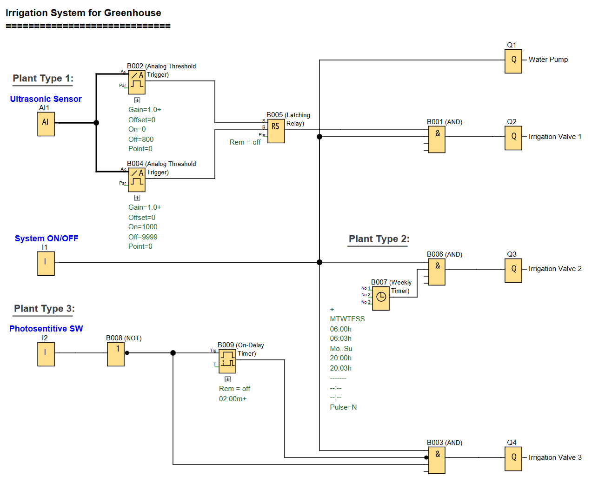

# LOGO! PLC Project: Greenhouse Irrigation Control System

**Automated irrigation for different plant types with water level control and scheduled watering.**

### Greenhouse Irrigation Control Function

---

## 📌 Overview

An automated irrigation system that controls three separate irrigation valves for different plant types in a greenhouse environment. Includes water level monitoring for aquatic plants and time-based irrigation schedules for other plant types.

Useful for:
- **Greenhouse Operations:** Automated irrigation for different plant species with varying water requirements
- **Aquatic Plant Maintenance:** Precise water level control for pond environments
- **Energy Efficiency:** Scheduled watering during optimal times

---

## 🧩 Required Blocks & Roles

| Block Type                   | Symbol ID             | Purpose                                         |
|------------------------------|-----------------------|-------------------------------------------------|
| **Digital Inputs**           | `I1/I2`               | Switching inputs (NO contact)                   |
| **Analog Input**             | `AI1`                 | Ultrasonic water level sensor (0-10V)           |
| **Weekly Timer**             | `B007`                | Schedule control for Type 2 plants.             |
| **On-Delay Timer**           | `B009`                | Controls irrigation duration for Type 3 plants. |
| **Analog Threshold Triggers**| `B002/B004`           | Water level monitoring for Type 1 plants.       |
| **Latching Relay**           | `B005`                | Maintains pump state based on water level.      |
| **Logic Gates**              | `B001/B003/B006/B008` | Condition checking for system operation.        |
| **Outputs**                  | `Q1/Q2/Q3/Q4`         | Physical outputs.                               |

---

## 💧 Irrigation Schedule

### Water Pump (Q1)
- **Control Method:** 2-position switch
- **Activation:** Pump turns ON when switch (I1) is in the ON postion

### Type 1 Plants (Aquatic) - Irrigation Valve 1 (Q2)
- **Control Method:** Water level monitoring via ultrasonic sensor
- **Activation:** Valve OPENS when level is between 0 & 800, CLOSES when level = 1000
- **Conditions:** System enabled (I1 ON) AND water level outside acceptable range

### Type 2 Plants - Irrigation Valve 2 (Q3)
- **Schedule:** Daily at 06:00-06:03 AM and 20:00-20:03
- **Duration:** 3 minutes per irrigation cycle
- **Conditions:** Valve OPENS if system enabled (I1 ON) AND weekly timer active

### Type 3 Plants - Irrigation Valve 3 (Q4)
- **Schedule:** Evening irrigation triggered by photosensitive switch
- **Duration:** 2 minutes after photosensitive switch turns OFF
- **Conditions:** Valve OPENS if system enabled (I1 ON) AND photosensitive switch (I2) OFF

---

## ✔️ Advantages

- **Precise Water Level Control:** Maintains optimal water levels for aquatic plants with adjustable thresholds
- **Flexible Scheduling:** Easy modification of irrigation times through timer blocks
- **Energy Efficient:** Water pump only operates when needed
- **Light-Activated Irrigation:** Type 3 plants irrigate based on natural light conditions
- **Scalable Design:** Control program can be expanded for additional plant types
- **Fail-Safe Operation:** Requires manual system enable AND specific conditions to operate

---

## 🛠️ Notes

- Circuit is designed using **Siemens LOGO! Soft Comfort** software.
- Ultrasonic sensor provides 0-10V analog signal proportional to water level
- Photosensitive switch turns OFF at evening threshold
- System uses LOGO! 230RC controller with relay outputs
- Water pump (Q1) is enabled whenever the system is active and any irrigation valve requires water
- All timing parameters can be easily adjusted through block parameters
