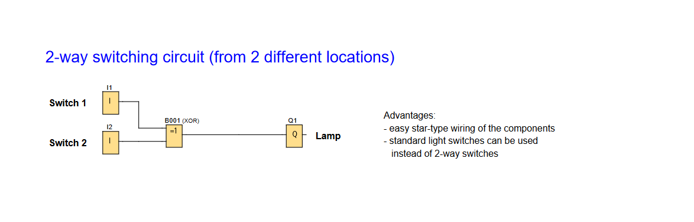

# LOGO! PLC Project: Multi-Location Lighting Control (2-Way Switching Circuit)

**Demonstrates switching control from 2 locations using standard switches.**

### 2-Way Lighting Switch Function

---

## 📌 Overview
A 2-way manual switching circuit allowing a light to be toggled from two locations using standard light switches.

Useful for:
- **Controlled Lighting:** Light up corridors or stairs from either end.

---

## 🧩 Required Blocks & Roles

| Block Type         | Symbol ID | Purpose                                                           |
|--------------------|-----------|-------------------------------------------------------------------|
| **Digital Inputs** | `I1/I2`   | Switching inputs (NO contact)                                     |
| **XOR Gate**       | `B001`    | XOR ensures a single pulse regardless of which switch is toggled. |
| **Output**         | `Q1`      | Physical output.                                                  |

---

## 📊 Truth Table

| Switch 1 | Switch 2 | Lamp (Q1) |
|----------|----------|-----------|
| 0        | 0        | Off       |
| 1        | 0        | On        |
| 0        | 1        | On        |
| 1        | 1        | Off       |

### ✔️ Advantages

- Star-type wiring
- Standard light switches instead of traditional 2-way switches
- Simple and reliable logic for basic toggle control

---

## 🛠️ Notes

- Circuit is designed using **Siemens LOGO! Soft Comfort** software.
- Wiring uses **star topology** for easy installation.
