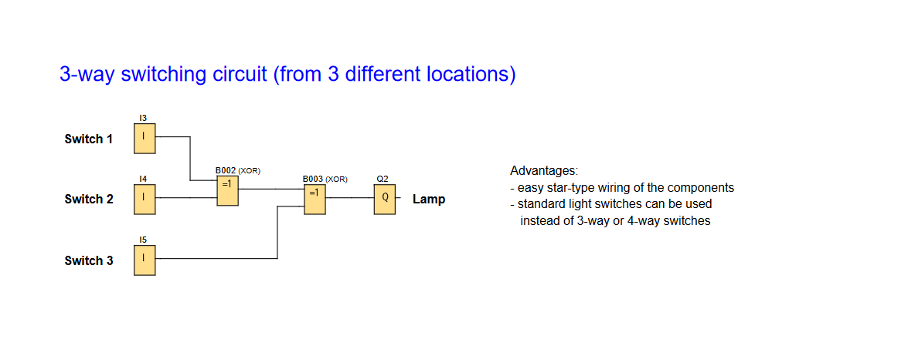

# LOGO! PLC Project: Multi-Location Lighting Control (3-Way Switching Circuit)

**Demonstrates switching control from 3 locations using standard switches.**

### 2-Way Lighting Switch Function

---

## 📌 Overview

A 3-way manual switching circuit enabling lighting control from three different locations.

Useful for:
- **Controlled Lighting:** Light up areas from multiple entrances.

---

## 🧩 Required Blocks & Roles

| Block Type         | Symbol ID   | Purpose                                                            |
|--------------------|-------------|--------------------------------------------------------------------|
| **Digital Inputs** | `I3/I4/I5`  | Switching inputs (NO contact)                                      |
| **XOR Gates**      | `B002/B003` | XOR's ensure a single pulse regardless of which switch is toggled. |
| **Output**         | `Q2`        | Physical output.                                                   |

---

## 📊 Truth Table

| Switch 1 | Switch 2 | Switch 3 | Lamp (Q2) |
|----------|----------|----------|-----------|
| 0        | 0        | 0        | Off       |
| 1        | 0        | 0        | On        |
| 0        | 1        | 0        | On        |
| 0        | 0        | 1        | On        |
| 1        | 1        | 0        | Off       |
| 1        | 0        | 1        | Off       |
| 0        | 1        | 1        | Off       |
| 1        | 1        | 1        | On        |

### ✔️ Advantages

- Star-type wiring
- Standard light switches instead of traditional 3 or 4-way switches
- Simple and reliable logic for basic toggle control

---

## 🛠️ Notes

- Circuit is designed using **Siemens LOGO! Soft Comfort** software.
- Wiring uses **star topology** for easy installation.
