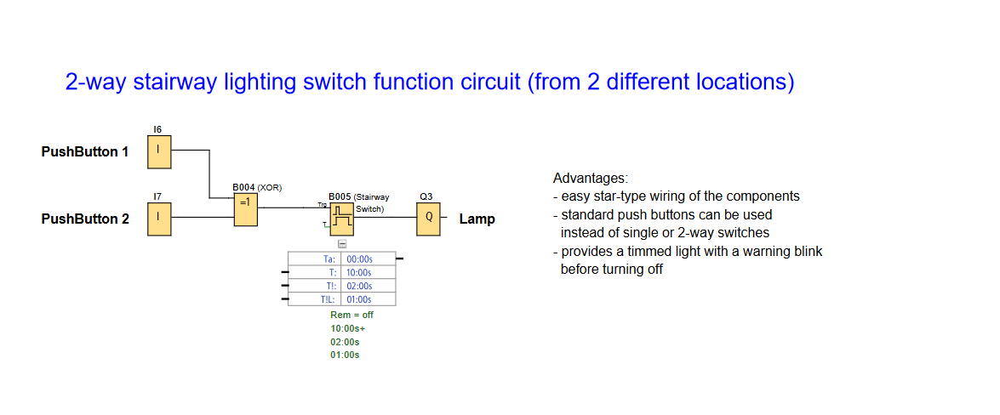

# LOGO! PLC Project: Multi-Location Lighting Control (Stairway Function Switching Circuit)

**Demonstrates switching and timed lighting control from multiple locations using standard pushbuttons. Includes a timer function with optional pre-warning blink feature.**

## 🖥️ LOGO!Soft FBD Programs

### 2-Way Stairway Lighting Switch Function

---

## 📌 Overview
A timed stairway lighting circuit using pushbuttons from two different locations. The output automatically turns off after a preset time and includes a **pre-warning blink** to notify users before the output turn off.

Useful for:
- **Controlled Lighting:** Light up corridors or stairs for a certain amount of time.
- **Resource Management:** Lights turn off automatically, saving energy.

---

## 🧩 Required Blocks & Roles

| Block Type         | Symbol ID | Purpose                                                           |
|--------------------|-----------|-------------------------------------------------------------------|
| **Digital Inputs** | `I6/I7`   | Momentary pushbutton inputs (NO contact)                          |
| **XOR Gate**       | `B004`    | XOR ensures a single pulse regardless of which button is pressed. |
| **Stairway Switch**| `B005`    | Timer function that controls lamp with pre-warning.               |
| **Output**         | `Q3`      | Physical output.                                                  |

### 🔁 Block Settings (Stairway Lighting Switch)

- **T**: 10s (Lighting duration)
- **TI**: 2s (Pre-warning time)
- **TII**: 1s (Pre-warning period)
- **Rem**: off (no memory)

---

## 📊 Truth Table

| PushButton 1 | PushButton 2 | Lamp (Q3) |
|--------------|--------------|-----------|
| 0            | 0            | Off       |
| 1 (pulse)    | 0            | On (10s)  |
| 0            | 1 (pulse)    | On (10s)  |
| 1 (pulse)    | 1 (pulse)    | Off (XOR) |

---

## ✔️ Advantages

- Easy star-type wiring
- Standard pushbuttons can be used
- Timed shutoff saves energy
- Optional pre-warning blink before shutdown

---

## 🛠️ Notes

- Circuit is designed using **Siemens LOGO! Soft Comfort** software.
- Wiring uses **star topology** for easy installation.
- For advanced behavior (e.g: repeated blinking in pre-warning), additional logic will be required.
