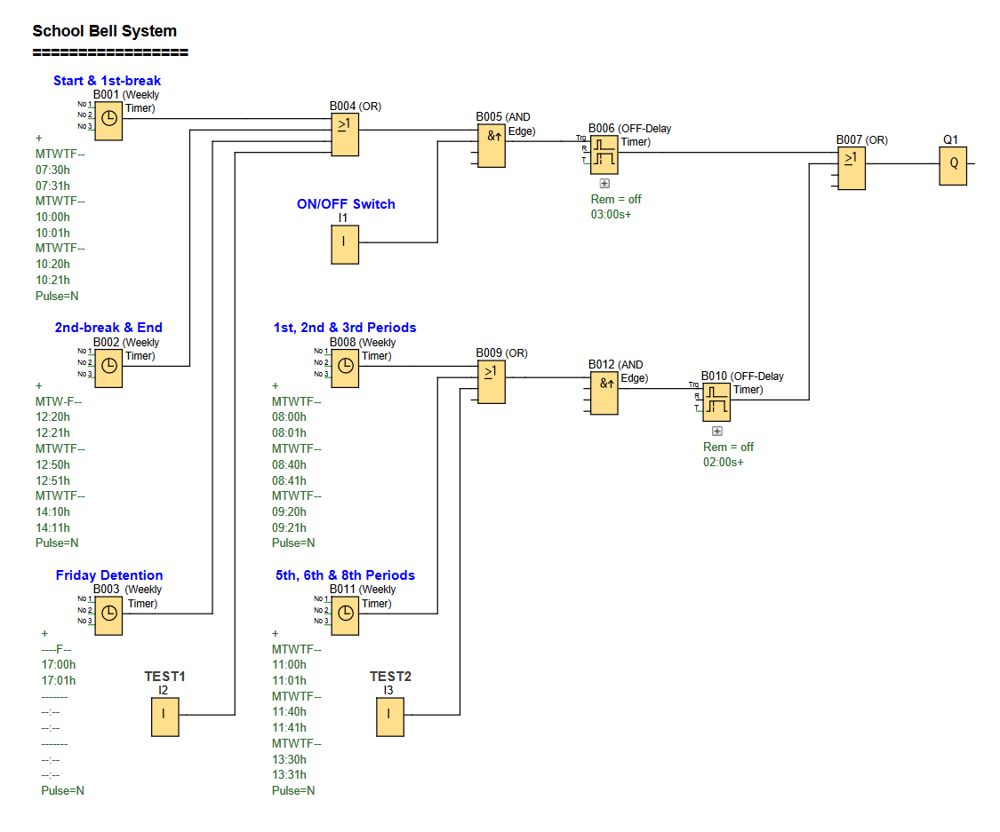

# LOGO! PLC Project: School Bell System

**Automated school bell scheduling with manual override for holidays.**

### School Bell Control Function

---

## 📌 Overview

An automated bell system that rings at predetermined times for school start, periods, breaks, and end of school day. Includes manual override for holidays.

Useful for:
- **Educational Institutions:** Automated bell scheduling for school periods and breaks
- **Testing & Maintenance:** Manual test functionality for system verification
- **Holiday Management:** Easy system disable during school holidays

---

## 🧩 Required Blocks & Roles

| Block Type          | Symbol ID                  | Purpose                                   |
|---------------------|----------------------------|-------------------------------------------|
| **Digital Inputs**  | `I1/I2/I3`                 | Switching inputs (NO contact)             |
| **Weekly Timers**   | `B001/B001/B003/B008/B011` | Schedule control for ringing of the bell. |
| **OFF-Delay Timer** | `B006/B010`                | Bell ring duration (3 seconds)            |
| **Logic Gates**     | `B004/B005/B009/B012`      | Condition checking for ringing the bell.  |
| **Output**          | `Q1`                       | Physical output.                          |

---

## 📊 Bell Schedule

### Regular School Days (Monday-Friday)
- **07:30** - School begins (Assembly)
- **08:00** - 1st Period starts
- **08:40** - 2nd Period starts
- **09:20** - 3nd Period starts
- **10:00** - Morning break starts
- **10:20** - Morning break ends / 4rd Period starts
- **11:00** - 5th Period starts
- **11:40** - 6th Period starts
- **12:20** - Lunch break starts
- **12:50** - Lunch break ends / 7th Period starts
- **13:30** - 8th Period starts
- **14:10** - School ends

### Friday Additional Schedule
- **17:00** - Detention classes end (Friday only)

---

## ✔️ Advantages

- **Holiday Management:** Easy ON/OFF switch for holiday periods
- **Testing Capability:** Manual test input for system verification
- **Consistent Timings:** Precise 2 and 3-second bell durations
- **Flexible Scheduling:** Easy modification of bell times through timer blocks

---

## 🛠️ Notes

- Circuit is designed using **Siemens LOGO! Soft Comfort** software
- Test functionality allows for manual bell activation without changing schedule
- 3-second bell duration for school start/end & break start/end times | 2-second bell duration for period start/end times
  -  this allows students to audibly differenciate periods rings from break start/end rings.

- Special Friday schedule accommodates detention classes ending at 17:00
