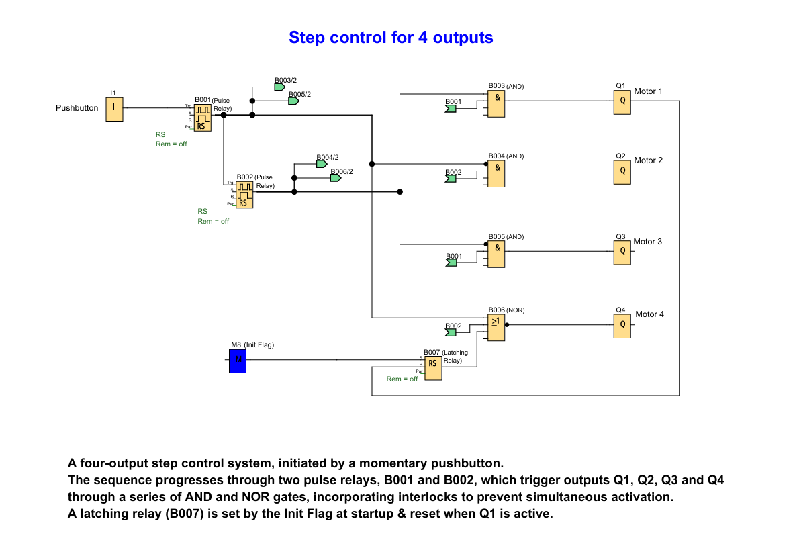

# LOGO! PLC Project: Step Control for 4 Outputs

**A four-output step control system, initiated by a momentary pushbutton. The sequence progresses through two pulse relays, B001 and B002, which trigger outputs Q1, Q2, Q3, and Q4 through a series of AND and NOR gates. Incorporates interlocks to prevent simultaneous activation.**

## 🖥️ LOGO!Soft FBD Programs

### Step Control for 4 Outputs

---

## 📌 Overview
This project demonstrates a step-controlled sequence for four outputs (Q1, Q2, Q3, Q4) using LOGO!Soft. The system is initiated by a momentary pushbutton, that when pressed, progresses through the outputs in a defined order, incorporating interlocking logic to prevent simultaneous activation of conflicting outputs.

Useful for:
- **Sequential Process Control:** Activating different stages of a process in a specific order.
- **Automated Systems:** Controlling a series of events or actions in a controlled sequence.
- **Resource Management:** Ensuring resources are allocated sequentially and exclusively.

---

## 🧩 Required Blocks & Roles

| Block Type         | Symbol ID        | Purpose                                                         |
|--------------------|------------------|-----------------------------------------------------------------|
| **Digital Input**  | `I1`             | Momentary pushbutton input (NO contact)                         |
| **Pulse Relays**   | `B001/B002`      | Generates a pulse output on activation.                         |
| **AND Gates**      | `B003/B004/B005` | Combines the pulse relay signals with the interlocking signals. |
| **NOR Gates**      | `B006`           | Used for interlocking.                                          |
| **Latching Relay** | `B007`           | Set via Init Flag & reset on sequence start.                    |
| **Marker Flag**    | `M8`             | Sets an initial flag at startup.                                |
| **Output Coils**   | `Q1/Q2/Q3/Q4`    | Physical outputs.                                               |

---

## 🔌 Connection Guide

### 1. **Step Control Sequence for Four Outputs**

- **Pushbutton Initiation:**
  <pre>
  I1 → Pulse Relay (B001) → AND (B004)
                          ↓
                          └── NOR (B006)
                          ↓
                          └── Pulse Relay (B002) → AND (B003)
                                                 ↓
                                                 └── AND (B005)
  </pre>

- **Motor 1 (Q1) Path:**
  <pre>
  I1 → Pulse Relay (B002) → AND (B003) → Q1
                          ↑
                          └── Pulse Relay (B001) interlock
  </pre>

- **Motor 2 (Q2) Path:**
  <pre>
  I1 → Pulse Relay (B001) → AND (B004) → Q2
                          ↑
                          └── Pulse Relay (B002) interlock
  </pre>

- **Motor 3 (Q3) Path:**
  <pre>
  I1 → Pulse Relay (B002) → AND (B005) → Q3
                          ↑
                          └── Pulse Relay (B001) interlock
  </pre>

- **Motor 4 (Q4) Path:**
  <pre>
  I1 → Pulse Relay (B001) → NOR (B006) → Q4
                          ↑
                          └── Pulse Relay (B002) interlock
                          ↑
                          └── Latching Relay (B007) interlock
  </pre>
  *Note: The specific interlock connections to prevent simultaneous activation.*

- **Initialization and Reset:**
  <pre>
  Init Flag (M8) → Latching Relay (B007) - Set Input
  Motor 1 (Q1)   → Latching Relay (B007) - Reset Input
  </pre>

---

## ⚙️ How the Step Control Works

The system controls the activation of four outputs (Q1, Q2, Q3, Q4) in a sequential manner, initiated by a momentary pushbutton.

- **Initiation:** Pressing the `Pushbutton (I1)` triggers `B001 (Pulse Relay)`, which then triggers `B002 (Pulse Relay)`.
- **First Stage:** `B001's (Pulse Relay)` output feeds into inverted `B004 (AND)` input and `B006 (XOR)`. These gates, combined with interlocks, control `Q2` and `Q4`.
- **Second Stage:** `B002's (Pulse Relay)` output feeds into `B003 (AND)` and into inverted `B005 (AND)` input. These AND gates, combined with interlocks, control `Q1` and `Q3`.

- **Interlocking:** The AND and NOR gates, along with feedback connections, ensure that outputs are activated sequentially and that conflicting outputs are not active simultaneously. For example, a `NOR` gate for `Q4` would ensure `Q4` is only active if *neither* of its inputs (including potential interlocks from other outputs) are true.

- **Initialization and Reset:** The `M8 (Init Flag)` sets `B007 (Latching Relay)` at startup, establishing an initial state. When `Q1` becomes active, it resets `B007`, indicating the start of the primary sequence. This mechanism ensures the system begins from a defined state.

*Key Insight: The use of pulse relays ensures momentary activation signals, and the combination of AND and NOR gates, along with the latching relay, manages the sequential progression and maintains interlocks for a robust step control system.*
