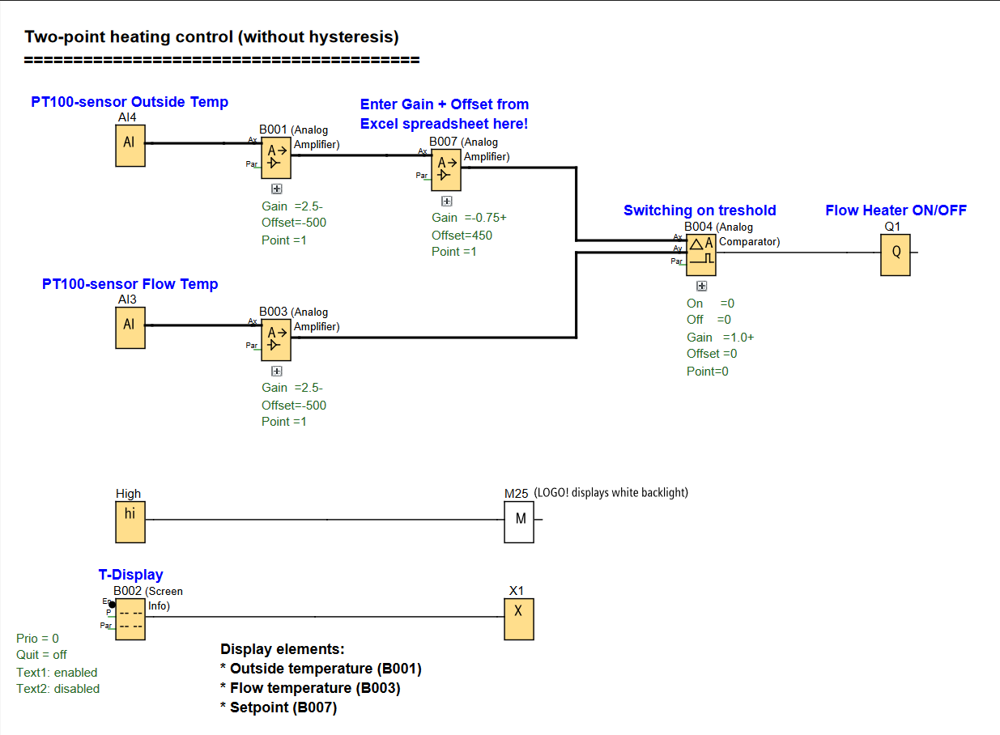

# LOGO! PLC Project: Two-Point Heating Control System

**Energy-efficient heating control using outside temperature compensation with PT100 sensors.**

### Two-Point Heating Control Function

---

## 📌 Overview

A heating control system that adjusts flow temperature based on outside temperature measurements using PT100 sensors. The system implements a heating curve where lower outside temperatures result in higher flow temperatures and vice versa, optimizing energy efficiency.

Useful for:
- **Building Automation:** Efficient heating control for residential and commercial buildings,
- **Energy Management:** Reduced energy consumption through temperature compensation,
- **HVAC Systems:** Precise temperature control in heating applications.

---

## 🧩 Required Blocks & Roles

| Block Type            | Symbol ID   | Purpose                                                          |
|-----------------------|-------------|------------------------------------------------------------------|
| **Analog Inputs**     | `AI3/AI4`   | Flow temperature and outside temperature sensors (PT100)         |
| **Analog Amplifiers** | `B001/B003` | Sensor signal scaling and calibration (Gain=2.5, Offset=500)     |
| **Analog Amplifier**  | `B007`      | Heating curve calculation (Gain=0.75, Offset=450)                |
| **Analog Comparator** | `B004`      | Compares outside temperature with flow temperature (On=0, Off=0) |
| **Text Display**      | `B002`      | Real-time temperature monitoring on LOGO! display.               |
| **Output**            | `Q1`        | Heating system ON/OFF control.                                   |

---

## 📊 System Parameters

### Sensor Configuration
- **AI3 (Flow Temperature):** PT100 sensor with 0.1°C resolution
- **AI4 (Outside Temperature):** PT100 sensor with 0.1°C resolution
- **Scaling:** Gain = 2.5, Offset = 500 for both sensors

### Heating Curve Control
- **B007 Parameters:** Gain = 0.75, Offset = 450 (calculated from Excel spreadsheet)
- **Comparator Settings:** Switching threshold at 0°C difference
- **Control Logic:** Heating turns on when outside temperature drops below calculated setpoint

---

## ✔️ Advantages

- **Energy Efficiency:** Automatic temperature compensation reduces energy consumption
- **Precise Control:** 0.1°C resolution provides accurate temperature regulation
- **Easy Configuration:** Parameters easily adjustable via Excel spreadsheet calculations
- **Real-time Monitoring:** Display shows outside temperature, flow temperature, and setpoint
- **Cost-Effective:** LOGO!-based solution cheaper than conventional heating controllers
- **Flexible Adaptation:** Easily adjustable to individual building requirements

---

## 🛠️ Notes

- Circuit is designed using **Siemens LOGO! Soft Comfort** software
- Requires **LOGO! 12/24RC** with **AM2 PT100** analog module for temperature sensing
- Heating curve parameters must be calculated using the provided Excel spreadsheet
- System uses comparator with 0°C threshold - output activates when temperature difference > 0
- Real-time display shows:
  - Outside Temperature (B001-Ax) °C
  - Flow Temperature (B003-Ax) °C  
  - Setpoint (B007-Ax) °C